# Impact-of-weather-on-Airline

## Project Background
With the rapid development of China's civil aviation industry and the increasingly restored and increasing demand for civil aviation transportation in the post-epidemic era, the impact of weather on the status of aircraft and flights has attracted more and more attention from passengers. This experimental project aims to study the impact of weather conditions on the status of aircraft and flights, so that passengers can be more comfortable to take Chinese civil aircraft and travel more safely.

## Project Content And Process

### Getting Data 
All the data were obtained from publicly available datasets. Weather data comes from Weather Now and MSN, and flight data comes from the industry version.

### Data Preprocessing
- Flight Data 
  - Outbound flights from Shenzhen Bao'an International Airport 
  - Remove flights with wrong status (missing delay information) 
  - Quantify the delay time of the string type, negative for delay and positive for advance 
  - The weather time is added to correspond to the weather data and easily obtain the weather information of the aircraft before takeoff, subject to the expected departure time of the aircraft (`ptd_time`). For example, the plane is expected to take off at 19:46, and the weather time is taken at 19:00

- Weather Data 
  - Some string data were quantified into numbers, including: `temperature (°C)`, `dew point (°C)`, `humidity (%)`, `density height (m)`, `atmospheric pressure (mb)`, `visibility (km)`, `wind speed (m/s)`, `precipitation (mm)` 
  - Processing wind direction information: the calculation method of the wind direction Angle in the data is to take the due north as the reference axis, and the Angle between the clockwise direction and the wind direction. According to the data, the Angle between the runway and the benchmark of Bao'an International Airport is 153. Due to the influence of the research direction on the aircraft, we need to study the sharp Angle between the wind direction and the airport runway, as shown in the figure. Thus we obtained the angle `Wind Included Angle(°)` 
  - Sometimes the wind direction changes greatly, so sometimes a fixed wind speed is not detected, labeled "Vrb", we establish a wind direction change indicator `Vrb_pool`, a value of 1 means the direction is erratic, and a value of 0 means the direction is relatively fixed. Sometimes the wind suddenly accelerates, with `Wind_woods_pool` as an indicator 
  - Lightning situation

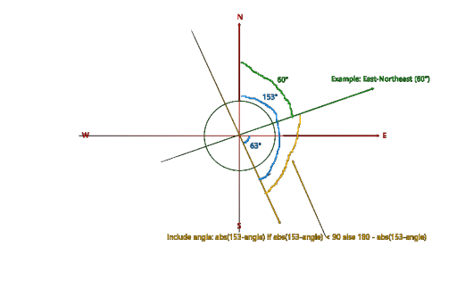

- Time Data 
  - In order to distinguish the information of different flights, we added a time information for each flight Timestamp. The meaning is the number of minutes after the expected departure time of 0:00 on the day.

### Exploratory and detailed data analysis
We will explore the impact of flight delays and weather from different time scales.

#### Daily
We narrowed the granularity of the data and explored the impact of weather on flight delays with daily data. Time range is 2024.4.19-2024.5.19.
- a. Calculate the daily flight cancellation rate Calculation method: count the number of flight cancellations per day, divided by the total number of flights per day.
- b. Daily precipitation: The precipitation data comes from MSN, which is the daily precipitation data of Shenzhen 
- c. Calculate the average day degree of each weather indicator
- d. Draw a line chart of the weather indicators and flight cancellation rates

> 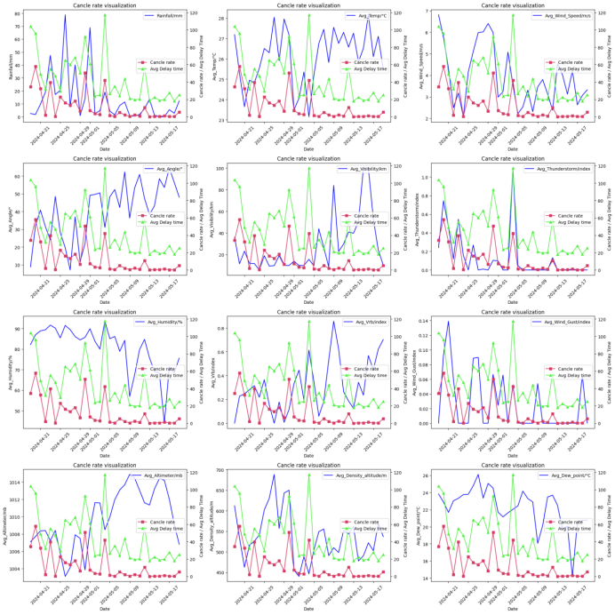
> 
> This large chart depicts a breakdown of different weather indicators and flight cancellation rate and average delay time.

- e. Calculate Correlation Matrix

> 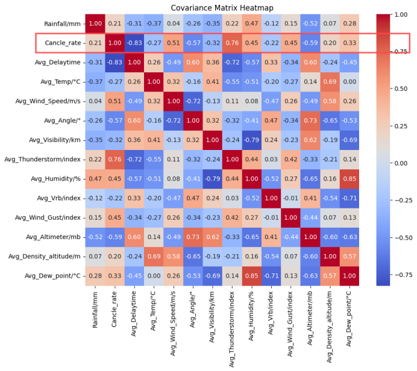
> 
> The correlation between the different indicators can be seen from Fig. Let's focus on the relationship between weather indicators and plane-flight cancellation rates. We found that the **Lightning Situation (`Thunderstorm`), Wind Speed (`Wind_Speed`), Wind Angle (`Wind_Included_Angle`) and Air Pressure (`Altimeter`) correlated with the aircraft flight Cancellation Rate (`Cancle_rate`), at 0.76,0.61, -0.57, -0.59, respectively.**

#### Hourly
**a. Regression Analysis**

Since the delay time of the aircraft route is continuous, we can use the regression analysis accordingly. Since there was no delay time for the cancelled flights, we removed the cancelled flights.

1. Index Distribution Map
> 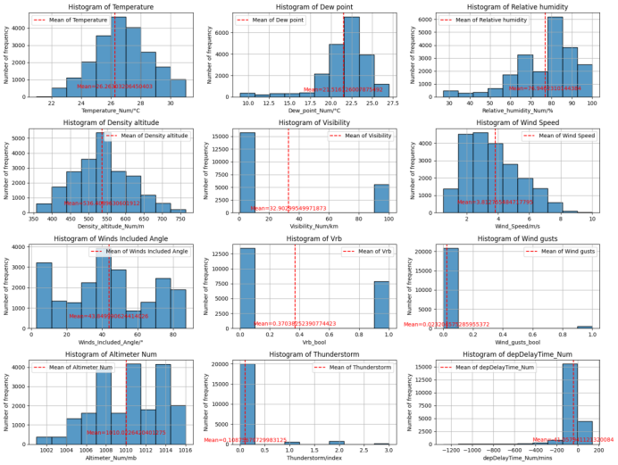
> 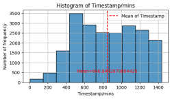
> 
> These two graphs show the frequency number distributions of the different indicators. Where the blue is the bar graph and the red is the index mean.

2. Statistical Indicators of Some Indicators

| Statistic      | Temperature (°C) | Wind Speed (m/s) | Altimeter (mb) | depDelayTime (mins) | Timestamp (mins) |
|----------------|------------------|------------------|----------------|---------------------|------------------|
| count          | 21332.000000     | 21332.000000     | 21332.000000   | 21332.000000        | 21332.000000     |
| mean           | 26.263032        | 3.812755         | 1010.022642    | -41.057941          | 846.843287       |
| std            | 1.897435         | 1.812555         | 3.445988       | 80.613757           | 329.118001       |
| min            | 21.000000        | 0.500000         | 1001.000000    | -1276.000000        | 5.000000         |
| 25%            | 25.000000        | 2.000000         | 1007.000000    | -35.000000          | 560.000000       |
| 50%            | 26.000000        | 4.000000         | 1010.000000    | -16.000000          | 835.000000       |
| 75%            | 28.000000        | 5.000000         | 1013.000000    | -7.000000           | 1135.000000      |
| max            | 31.000000        | 10.000000        | 1016.000000    | 136.000000          | 1439.000000      |

3. Data standardization: Data were standardized using the zscore method
4. Collinearity exploration of the features

To explore the collinearity of the features, we used the VIF algorithm. The results are as follows:

> 

| Features                        | VIF          |
|---------------------------------|--------------|
| Density_altitude_Num           | 3139.062493  |
| Temperature_Num                 | 2659.028464  |
| Altimeter_Num                   | 660.411716   |
| Relative_humidity_Num           | 95.946777    |
| Dew_point_Num                   | 60.596299    |
| Visibility_Num                  | 1.690040     |
| Wind_Speed                      | 1.679882     |
| Winds_Included_Angle           | 1.608399     |
| Vrb_bool                        | 1.408346     |
| Thunderstorm                    | 1.322964     |
| Timestamp/mins                  | 1.089540     |
| depDelayTime_Num/mins          | 1.087310     |
| Wind_gusts_bool                 | 1.053512     |

It can be seen that the collinearity between features `Density_altitude`, `Temperature`, `Altimeter`, `Relative_humidity`, `Dew_point` and other features is very large, much greater than 10. 

If we take 10 as the benchmark, remove the features with the greatest collinearity each time, and then iterate until each feature collinearity is less than 10, the algorithm is as follows:

> 

The two features and the final result are:
```
Drop: Density_altitude_Num 
Largest vif: 3139.0624926858127 
Drop: Relative_humidity_Num 
Largest vif: 38.27430199564595
```

| Features                        | VIF          |
|---------------------------------|--------------|
| Dew_point_Num                   | 2.168614     |
| Altimeter_Num                   | 2.024768     |
| Wind_Speed                      | 1.678328     |
| Visibility_Num                  | 1.673014     |
| Winds_Included_Angle           | 1.493034     |
| Vrb_bool                        | 1.396625     |
| Temperature_Num                 | 1.371840     |
| Thunderstorm                    | 1.211068     |
| depDelayTime_Num/mins          | 1.080882     |
| Timestamp                       | 1.057202     |
| Wind_gusts_bool                | 1.048487     |

5. Explore The Importance of Features

We used the random forest algorithm to explore the contribution of different features to the delay time of aircraft flights. To understand the significance of each original feature in more detail, we did not remove the features with high collinearity. The algorithm is as follows:

> 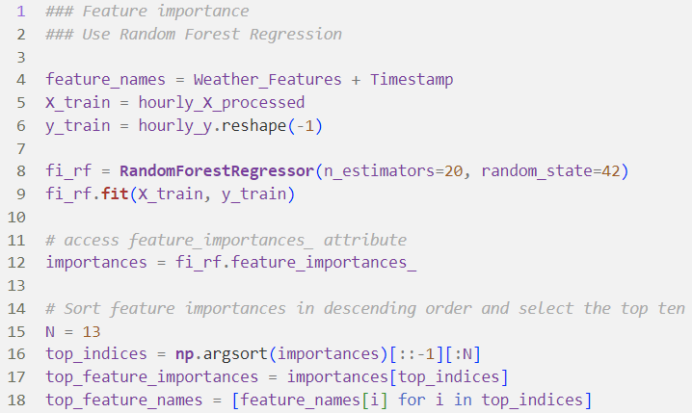

Results are shown in the following below:

> 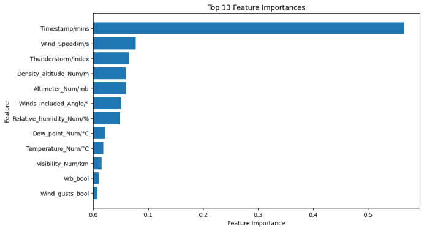
>
> As can be seen from the graph, the time stamp has the greatest impact on aircraft flight delays. However, this is not a characteristic of the weather, so we do not discuss the characteristics of time for now. Among the weather characteristics, wind speed (`Wind_Speed`), lightning, density (`Thunderstorm`), height (`Density_altitude`), pressure (`Altimeter`), angle of wind (`Wind_Included_Angle`) and humidity (`Relative_humidity`) are the most important. **If the characteristic of high collinearity is removed, we can think that the real factors that affect the flight delay are wind speed (`Wind_Speed`), lightning (`Thunderstorm`), air pressure (`Altimeter`) and wind angle (`Wind_Included_Angle`). It is basically consistent with the conclusion of the previous daily correlation analysis.[Daily correlation results: lightning situation (`Thunderstorm`), wind speed (`Wind_Speed`), wind angle (`Wind_Included_Angle`) and air pressure (`Altimeter`) are highly correlated with aircraft flight cancellation rate (`Cancle_rate`), respectively 0.76,0.61, -0.57, -0.59.]**

6. Training of the Data Using AutoML

Before training with AutoML, we split the data into the training set and the test set. The ratio of the training set and the test set was 8:2.

Then we selected the top 3 models in R2:

| Model                             |   MAE    |     MSE      |   RMSE    |    R2    |  RMSLE   |   MAPE   | TT (Sec) |
|-----------------------------------|----------|--------------|----------|----------|----------|----------|----------|
| Light Gradient Boosting Machine    | 38.2630  | 6152.5278    | 78.2390  | 0.2178   | 1.6683   | 1.8157   | 0.2110   |
| Gradient Boosting Regressor        | 40.6083  | 6287.6531    | 79.0643  | 0.2028   | 1.7460   | 2.1074   | 0.3270   |
| CatBoost Regressor                 | 38.2230  | 6318.1294    | 79.3037  | 0.1954   | 1.6617   | 1.7918   | 2.4740   |

The top 3 models were then applied to the test set:

| Model                             |   MAE    |     MSE      |   RMSE    |    R2    |  RMSLE   |   MAPE   |
|-----------------------------------|----------|--------------|----------|----------|----------|----------|
| Light Gradient Boosting Machine    | 24.1803  | 1365.2103    | 36.9488  | -0.4088  | 1.2970   | 2.9881   |
| Gradient Boosting Regressor        | 28.3775  | 1556.5789    | 39.4535  | -0.6063  | 1.3953   | 3.5228   |
| CatBoost Regressor                 | 23.2541  | 1224.3658    | 34.9909  | -0.2635  | 1.2865   | 2.8354   |


From the results of the training set and the test set, using Light GBM is better. However, R2 in the training set is positive, but R2 in the test set is negative. The preliminary judgment is that the model is underfitted, which is where we need to improve.

**b. Classification Analysis**

Due to cancellations, to be more detailed about the weather on flight delays. We discretized the flight delays. If a flight is cancelled, the value is 1; if it is not cancelled, the value is 0. The problem becomes a dichotomous problem.

1. Using the Kmeans-cluster

We first used a simple classifier to classify with the algorithm as follows:

> 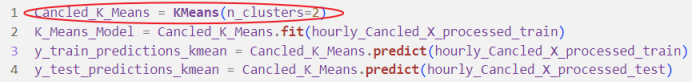

The results on the test set are as follows:

> 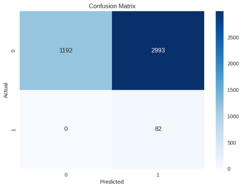
>
> It can be seen that the accuracy is relatively low, only 0.3, and a large number of Type-II error. The preliminary analysis is that the model used is a linear model, which is very different from the actual distribution of features.

2. Using the SVM

To solve the deficiency of Kmeans-cluster, we use SVM for classification and added kernel function. The algorithm is as follows:

> 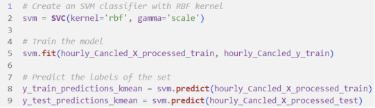

The results on the test set are as follows:

> 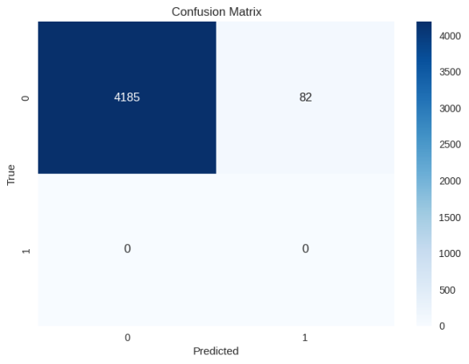
> 
> It can be seen that the accuracy of the model has been greatly improved, reaching 0.98. Therefore, it is certain that the impact of weather on aircraft and flights is non-linear.

3. Using the AutoML

Similar to the regression analysis, we also trained with AutoML in the classification. The top three results of the accuracy of the model on the training set are as follows:

| Model                             | Accuracy |    AUC     | Recall |  Prec.  |    F1    |  Kappa  |   MCC   | TT (Sec) |
|-----------------------------------|----------|------------|--------|---------|----------|---------|---------|----------|
| CatBoost Classifier                | 0.9123   | 0.9406     | 0.5584 | 0.6950  | 0.6184   | 0.5696  | 0.5745  | 4.8500   |
| Light Gradient Boosting Machine     | 0.9104   | 0.9420     | 0.5781 | 0.6734  | 0.6209   | 0.5706  | 0.5734  | 0.2490   |
| Extreme Gradient Boosting           | 0.9089   | 0.9426     | 0.5906 | 0.6604  | 0.6226   | 0.5710  | 0.5728  | 0.3260   |

The results of the test set are as follows:

| Model                             | Accuracy |    AUC     | Recall |  Prec.  |    F1    |  Kappa  |   MCC   |
|-----------------------------------|----------|------------|--------|---------|----------|---------|---------|
| CatBoost Classifier                | 0.9808   | 0.7881     | 0.0000 | 0.0000  | 0.0000   | 0.0000  | 0.0000  |
| Light Gradient Boosting Machine     | 0.9658   | 0.8710     | 0.1220 | 0.1190  | 0.1205   | 0.1030  | 0.1030  |
| Extreme Gradient Boosting           | 0.9691   | 0.8411     | 0.1220 | 0.1429  | 0.1316   | 0.1159  | 0.1163  |


From the results, both the training set and the test set had good accuracy, with the best results using the Cat Boost classifier. However, the accuracy of the test set is higher than that of the training set, which is quite abnormal. The initial reason is that the model is underfitting. This needs to be improved.

## Conclusions and Experiences

In this project, we explore the factors affecting aircraft delays by analyzing a month of aircraft routes and weather data. In the analysis of diurability, we found through the correlation that lightning (`Thunderstorm`), wind speed (`Wind_Speed`), wind angle (`Wind_Included_Angle`) and air pressure (`Altimeter`) were highly correlated with aircraft flight cancellation rate (`Cancle_rate`). 

In the analysis of hours, we used two ways to explore, one is regression analysis, the other is classification analysis. In the regression analysis, we used the VIF algorithm and the random forest algorithm to explore the importance of different weather factors, and found that wind speed (`Wind_Speed`), lightning (`Thunderstorm`), air pressure (`Altimeter`) and wind angle (`Wind_Included_Angle`) had large factors. We then used Auto Machine Learning regression to find a suitable model and found that Light GBM was better. 

Therefore, in general, the main factors affecting the aircraft flight delay are lightning, wind speed, air pressure and wind Angle. In the taxonomic analysis. 

We used the Kmeans-cluster algorithm and the SVM algorithm. The comparison shows that SVM algorithm is much better than Kmeans-cluster algorithm, indicating that the influence of weather and aircraft route is non-linear. Then we used Auto Machine Learning again and used the classification model instead, and found that the Cat Boost classifier worked the best. 

There were also some difficulties during the experiment, such as when using Auto Machine Learning, the results of the model on the training set and on the test set were very unusual. That's where we need to improve.
